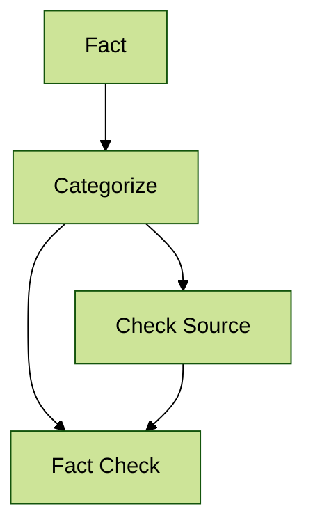

Reading a case study that evaluates the efficacy to modern day censorship of misinformation.

**Case Study Reading:** [Censorship of Misinformation and Freedom of Speech on Social Media](https://mit-serc.pubpub.org/pub/lkf63cu5/release/1)

The Discussion
---
**Part 1: Case Study Summary**  
In this case study, the author breaks down the idea of misinformation censorship and describes how it is disadvantageous with its current application to social media. 

**Part 2: Going Deeper**  
I agree with a lot of what the article is saying. With social media being as widespread and addictive as it is, it is very easy to turn to it as a news source. That being said, I think misinformation can also be categorized outside of the world of news as well, in order to introduce a whole new can of worms: advertising.

Recently, my YouTube advertisements have been bombarded with AI generated ads of ‘realistic’ robot puppies or ‘high quality’ running shoes (along with ads for Liberty Mutual, of course). These advertisements promise high quality products, but severely disappoint on the delivery. Some may go as far as to create okay-looking websites and steal reviews from genuinely good products to post on said website. And the issue is, these ads are everywhere! 

So, how do we solve this wave of misinformation, both in the news as well as the advertisement sphere? Well, I believe that, unlike the author, censorship (aka regulation) could be a beneficial improvement specifically for ads. To handle the news, however, the author does not provide any details (which left me dissatisfied to be honest). 

But let’s say, hypothetically, we consider the idea of censorship for news-based information on social media. Would it be justified? I think not. Since social media platforms are run by private businesses and corporations, they have control over what voices can be restricted or amplified. And, historically, businesses usually don’t have the general population in mind. Since they use a for-profit scheme, their main motivator will simply be money (while simultaneously keeping them out of legal trouble). Therefore, I think companies would do the bare minimum to keep legal battles at bay while raking in the cash, giving very little notion to what content is being displayed on their platform.

But where does that leave us today? What can *we* do to ensure the information we are consuming and sharing is correct? I think we can answer this question with a lovely flowchart! Details for each step can be found below.

Categorize: Sort your information by its "type": is it a simple factual statement, a statistic, an opinion, etc?

Check Source: If your 

**Part 3: Going Beyond**  

**Part 4: Reflection**  
